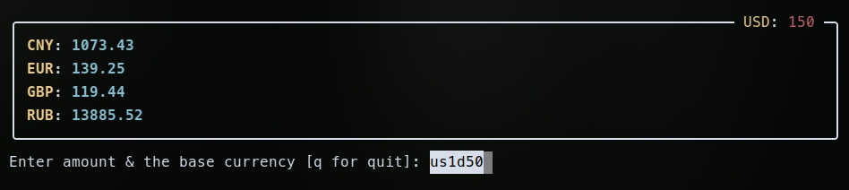
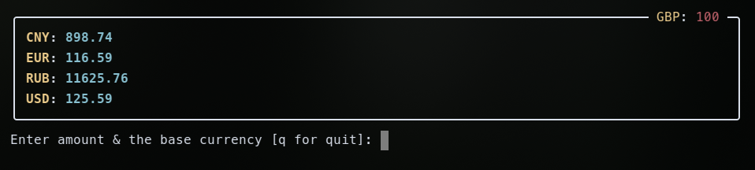
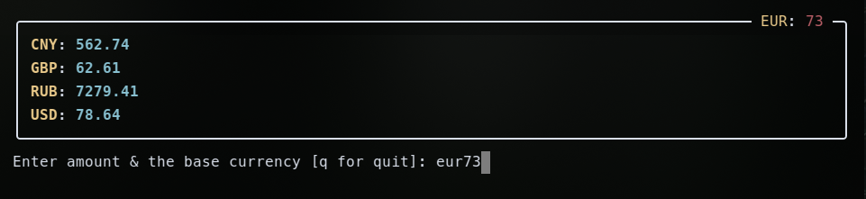
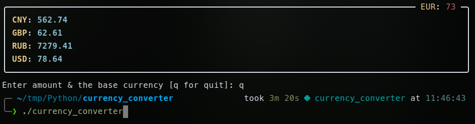

# utils
## Currency Converter

- works with weird inputs:


- different currencies


- nice look


- no need in ".py" extension - just name of the script


### Installation:
- git clone repo
- create & activate virtual environment:
  ```Python3
  python3 -m venv venv
  source venv/bin/activate
  ```
- pip-install 3 required modules:
  ```Bash
  pip install -r requirements.txt
  ```
- get free API Key @ https://app.freecurrencyapi.com/
- write it to .env file:
  ```Bash
  TOKEN=<your API Key> # no symbols like '"' or '<>' required and mind "no spaces"
  ```
  
- start script:
  ```Bash
  ./currency_converter
  ```
